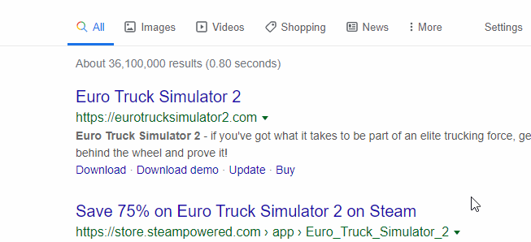

# Steam Store Tooltip

  

A Chrome extension that shows an informational tooltip when hovering a [Steam](https://store.steampowered.com) store link

  

## Features
- Quickly see all the relevant game's info in a tooltip:
  - price and discount
  - screenshots
  - categories
  - wishlisted or owned game (_available if you're logged in on the browser_)
  - description
  - Release date
  - platforms
- Choose the store language
- Choose the store currency (_available if you're __not__ logged in on the browser_)
- Activate the tooltip with a chosen key